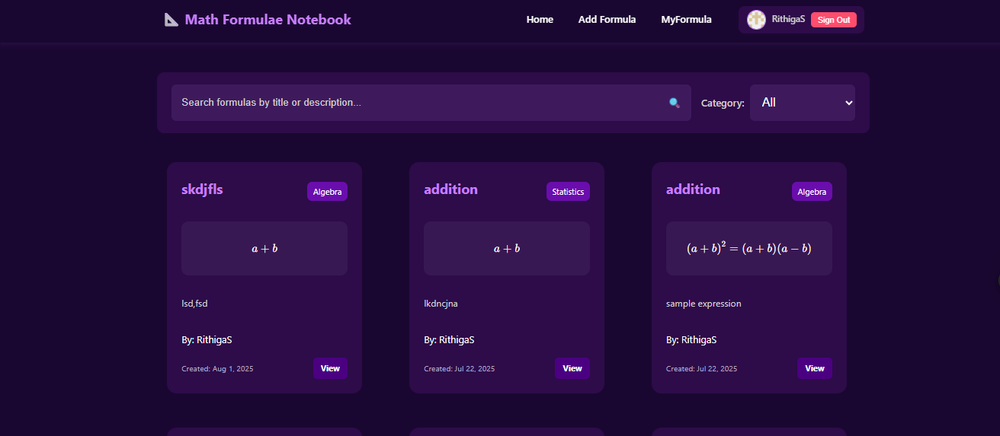

# 📘 Math Formula Book 🧮✨

🚀 **A clean & simple Math Formula Book built with Next.js + NextAuth**
📚 Quick access to important formulas with a modern UI and smooth experience.

🌐 **Live Demo:** [https://math-formula-book.vercel.app/](https://math-formula-book.vercel.app/)

---

# Output Screenshot



## ✨ Features

✅ Built with **Next.js (App Router)** ⚡
✅ **NextAuth** for authentication 🔐
✅ Fast, responsive & SEO‑friendly 📱💨
✅ Clean UI for easy learning 🎯
✅ Deployed on **Vercel** ☁️

---

## 🛠 Tech Stack

🧠 **Framework:** Next.js
🔐 **Auth:** NextAuth.js
🎨 **Styling:** CSS / Tailwind (if used)
☁️ **Deployment:** Vercel

---

## 🚀 Getting Started

📦 Install dependencies:

```bash
npm install
```

▶️ Run the development server:

```bash
npm run dev
```

🌍 Open in browser:

👉 [http://localhost:3000](http://localhost:3000)

---

## ✏️ Project Structure

🗂 Edit the main page here:

```
app/page.js
```

♻️ Changes auto‑reload as you save — instant feedback ✨

---

## 🔤 Fonts & Optimization

🎯 Uses **next/font** for automatic font optimization
🆕 Includes **Geist Font** by Vercel for a modern look 😍

---

## 📦 Deployment

🚀 Easily deploy using **Vercel** (recommended by Next.js)

🔗 Docs: [https://nextjs.org/docs/app/building-your-application/deploying](https://nextjs.org/docs/app/building-your-application/deploying)

---

## 📖 Learn More

📘 Next.js Docs → [https://nextjs.org/docs](https://nextjs.org/docs)
🎓 Learn Next.js → [https://nextjs.org/learn](https://nextjs.org/learn)
💻 GitHub Repo → [https://github.com/vercel/next.js](https://github.com/vercel/next.js)

---

## ❤️ Final Note

✨ Built with passion for students & learners
📚 Making math easier, faster & smarter

💙 Happy Coding & Learning 🚀😊
